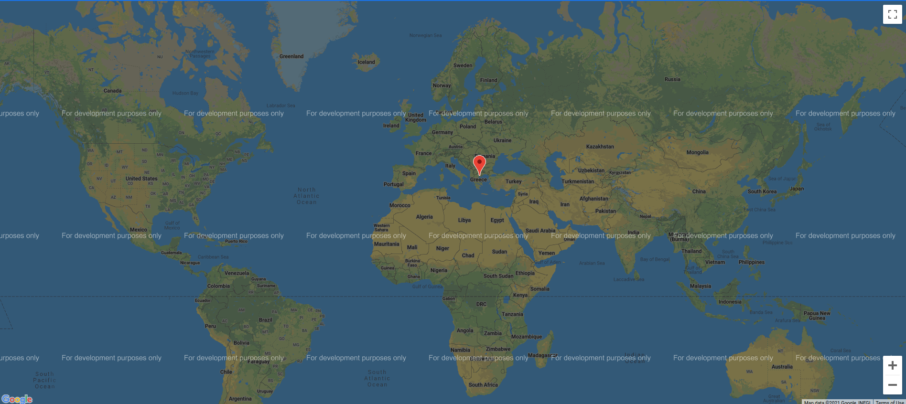

# ipTrace

# New Features

### Added support for mobile applications using Termux. Instead of displaying the map in the normal way, the script opens a SimpleHTTPServer and triggers the OS to open the link.
#### Fixed some bugs with file locations. Installation script now installs itself in /bin directory instead of /sbin
#### --visual mode now outputs a file as well. You need to supply the filename after the --visual argument like so 
`./iptrace.py -i {your-domain} --visual {output_filename}`
## Note: Installing the script over the installation script provided is not adviced on Termux!


# Installation Tips
### Firefox required
### Linux

This script is written in python3 so python3 is required
Clone the git repository to your local machine
```bash
git clone https://github.com/Konstantinos-Papanagnou/ipTrace.git
```
In order for the script to function correctly it requires some libraries. Use the following commands to install them if missing 
Install the libraries from pip 
```bash
pip install json
pip install webbrowser
pip install argparse
pip install requests
```
Or use pip3 in case you have both python2 and python3 installed on your system
```bash
pip3 install json
pip3 install webbrowser
pip3 install argparse
pip3 install requests
```

If you want to include it in your path you can run `chmod +x setup.sh` and `sudo ./setup.sh`

Everything is set! Now you can fire up the script

### Windows
In order to run this script on windows, download the repository to your computer and make sure you have python3 installed or anaconda with python3.

Install the same libraries from the command line.
Install the libraries from pip 
```batch
pip install json
pip install webbrowser
pip install argparse
pip install requests
```
Or use pip3 in case you have both python2 and python3 installed on your system
```batch
pip3 install json
pip3 install webbrowser
pip3 install argparse
pip3 install requests
```
Everything is set! Now you can fire up the script.

# Usage

```bash
**********************************************************************************************
                                 IP TRACE BY KONSTANTINOS PAP
                          POWERED BY ip-api & whatismyipaddress.com
**********************************************************************************************
usage: iptrace.py [-h] [-v] [-a] [-m] [--visual htmloutputfile] [-o outputfile] (-l inputfile)/(-i ipaddr)

Automation script for ip lookup

optional arguments:
  -h, --help            show this help message and exit
  -i INPUT, --input INPUT
                        The ip address or domain name to examine
  -v, --verbose         Increase output verbosity
  -l LISTINPUT, --listinput LISTINPUT
                        Input a list of addresses and/or domain names from an external file.
                        The file must contain one ip address or domain name per line
  -o OUTPUT, --output OUTPUT
                        Output file to export data
  -a, --accurate        The ip-api is not very accurate on it\'s geolocation traces so use
                        the -a option to get more accurate results from
                        whatismyipaddress.com. whatismyipaddress strictly does not allow
                        webscraping to their website so you will be prompted there
                        automatically when using this option.
  -V VISUAL, --visual VISUAL
                        Create Visual Map and display it (Expects file location)
  -m, --mobile          Using Termux for android support

At least one of the -l or -i option must be declared!

```

Usage Example:
```bash
python3 iptrace.py -i [your ip or domain name] 
```

You can also pass in a list of ips like so:
```bash
python3 iptrace.py -l input.txt
```

You can also pass in a list of ips and write save the results to an external file like so:
```bash
python3 iptrace.py -l input.txt -o output.txt
```

ip-api is not always accurate. You can use the -a option to run the script in higher accuracy mode that indexes the whatismyipaddress.com that is more accurate.
whatismyipaddress.com does not allow webscraping to their results so instead of showing the results on the terminal you will be automatically prompted on firefox.
####  In addition to that you can't specify output files when you work with high accuracy mode!
```bash
python3 iptrace.py -l input.txt -a
```

####  You are now able to use --visual mode to create a Visual Map. This will create and open a htmloutput.html file that will contain all the ips that were successfully traced!
####  You can't use the -a option with --visual!
```bash
python3 iptrace.py -l input.txt --visual output.html
```

## Map Example (Note that this can pin point multiple ips from a list)



#### You can now run the script through Termux and automatically open the list in the default browser. In order to do that use the -m option.
```bash
python3 iptrace.py -i google.com --visual output.html -m
```